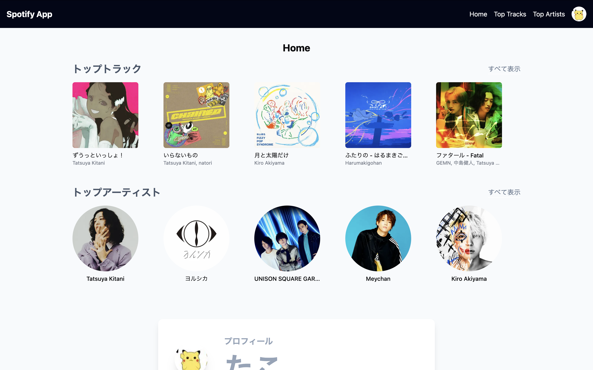
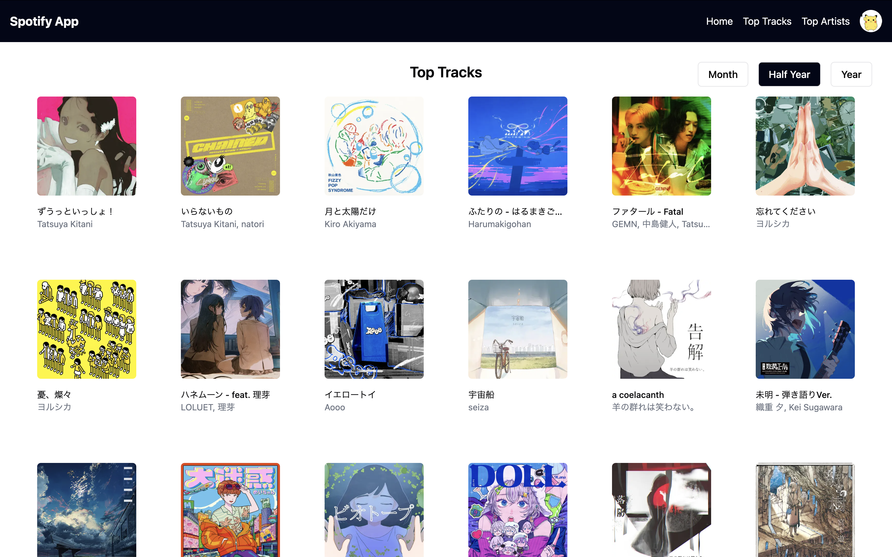
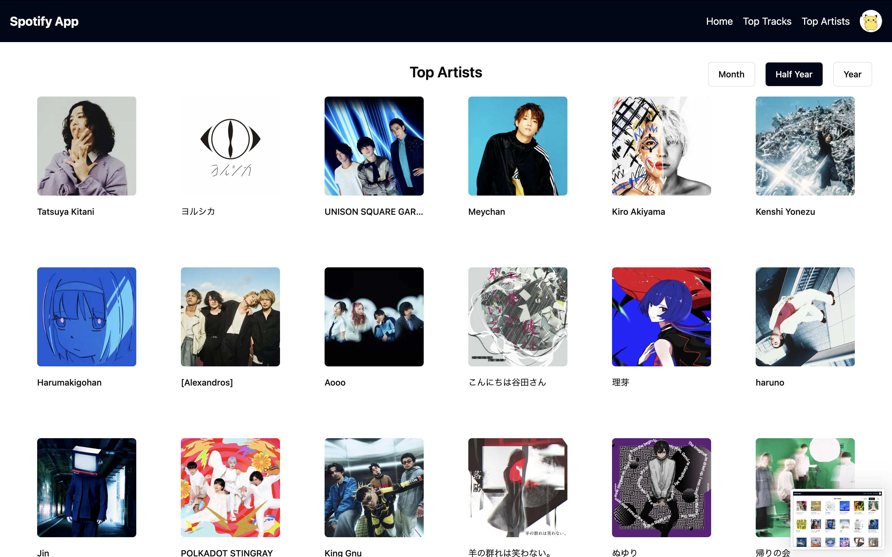

## ユーザの再生履歴を可視化するアプリ（Spotify APIの制限により開発中断）
#### アプリのリンク
Spotify APIの制限で開発者が手動でメールアドレスを設定しないと利用できないです
（誰でも利用できるようにするには申請が必要）
https://spotify-app-rouge.vercel.app/

アプリ画面

## 実装したい機能
- ユーザーのトップトラック（過去1ヶ月、6ヶ月、全期間）のリストを取得し、表示する。
- 各トラックの詳細情報（トラック名、アーティスト名、アルバム画像など）を表示。
- 考え中...

### 技術
- Next.js 14.2
- 認証
    - Next-auth 5.0.0-beta.21
- デプロイ先
    - Vercel